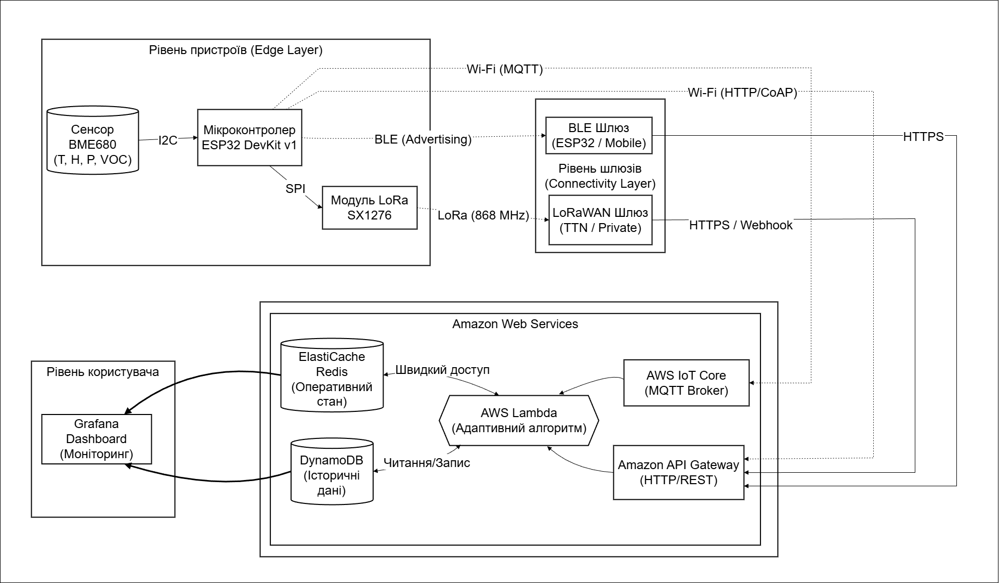
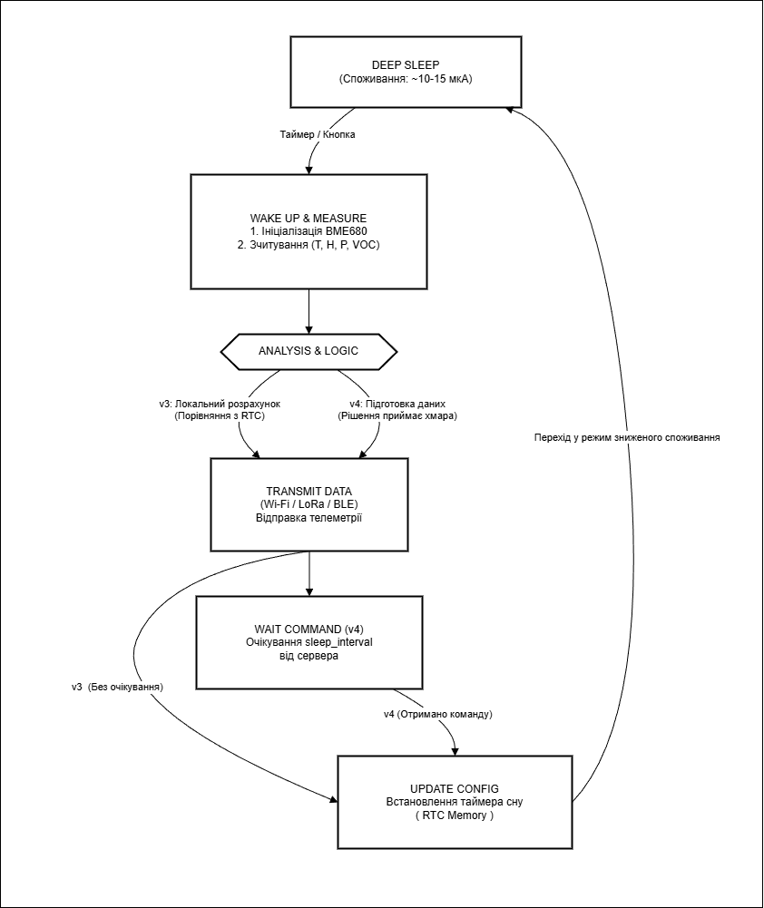
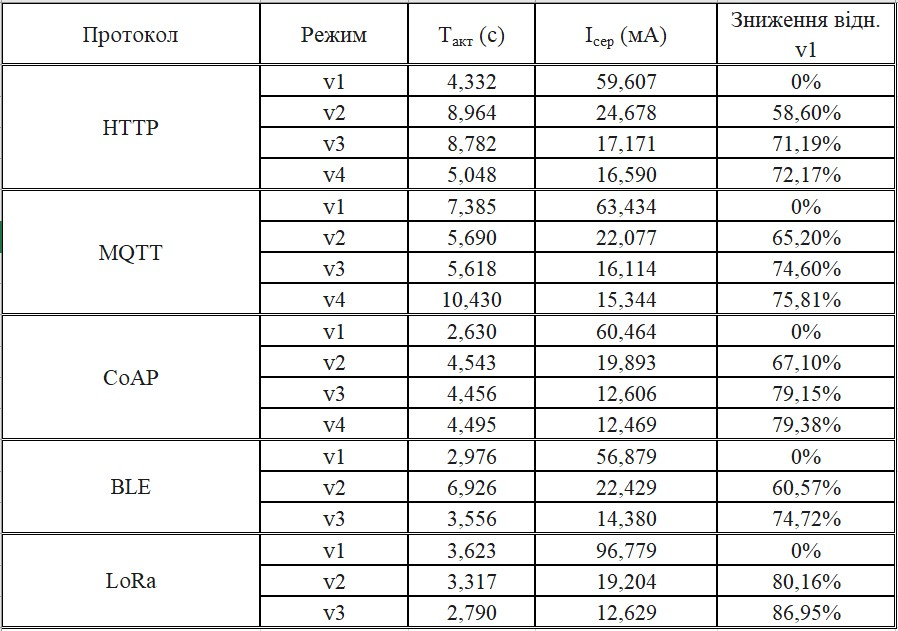
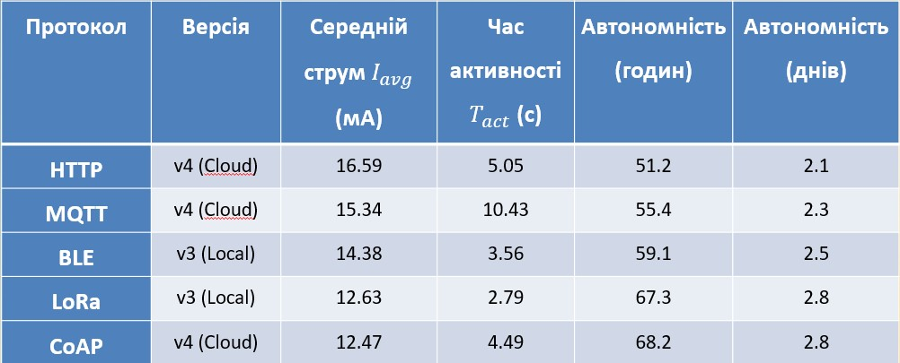

# IoT Climate Monitoring System: Power Supply Optimization Method

This repository contains the research data, firmware variations, and academic documentation for my Master's thesis at **Igor Sikorsky Kyiv Polytechnic Institute (KPI)**. 

The core of this work is the development and analysis of an adaptive algorithm designed to minimize power consumption in IoT sensor nodes using various communication protocols.

## 🎓 Academic Credentials
* **Institution:** Igor Sikorsky Kyiv Polytechnic Institute (KPI)
* **Faculty:** Faculty of Applied Mathematics
* **Department:** System Programming and Specialized Computer Systems (SP&SCS)
* **Author:** Illia Stetsiurenko

**Project Committee:**
* **Supervisor:** A. V. Petrashenko, Ph.D., Associate Professor (SP&SCS Dept.)
* **Reviewer:** T. M. Zabolotnia, Ph.D., Associate Professor (SE&CS Dept.)

## Research Objective
The project explores power optimization strategies for ESP32-based IoT nodes. It implements a comparative analysis of energy efficiency across five major communication protocols, utilizing an adaptive Finite State Machine (FSM) algorithm to manage deep-sleep cycles and data transmission frequency.

## Firmware Directory Structure (v2.X.Y)
The `src/` directory contains 12 project variations. They follow a structured naming convention to denote the protocol and optimization modification:

**Format:** `v2.[Protocol].[Modification]`

* **v2.1.x — MQTT Protocol:** Modifications for asynchronous data publishing.
* **v2.2.x — HTTP Protocol:** Standard RESTful API implementations.
* **v2.3.x — CoAP Protocol:** Lightweight machine-to-machine communication tests.
* **v2.4.x — BLE (Bluetooth Low Energy):** Energy-efficient proximity-based transfers.
* **v2.5.x — LoRaWAN:** Long-range, low-power wide-area network implementations.

Each modification represents a distinct power-saving strategy, such as adaptive sampling rates or payload optimization, with all confidential data removed for public release.

## Key Results & Visuals
### System Architecture
The system employs a multi-layered architecture for reliable data collection and secure transmission.

### Adaptive Algorithm (FSM)
The core logic for energy optimization is managed by a state machine that adapts behavior based on battery levels and environmental changes.

### Power Consumption & Autonomy Analysis
Empirical results demonstrate the effectiveness of the proposed optimization methods across different communication protocols. The research includes both raw power consumption measurements and real-world autonomy estimations based on a standard 1000 mAh battery capacity.

*Table 1: Power consumption metrics across different protocols and operational states.*

*Table 2: Estimated autonomous operation time (in hours and days) using a 1000 mAh power source.*

## Repository Contents
* `/src/` — Contains 12 project folders following the `v2.X.Y` convention.
* `/docs/Master_Thesis_Full_Text.pdf` — The complete academic paper.
* `/docs/Supervisor_Feedback.docx` — Official supervisor's report/feedback.
* `/docs/Review_Report.docx` — Official reviewer's report.
* `/images/` — Architectural diagrams and hardware photos.

---
*Successfully defended in December 2025 at the Faculty of Applied Mathematics, KPI.*
